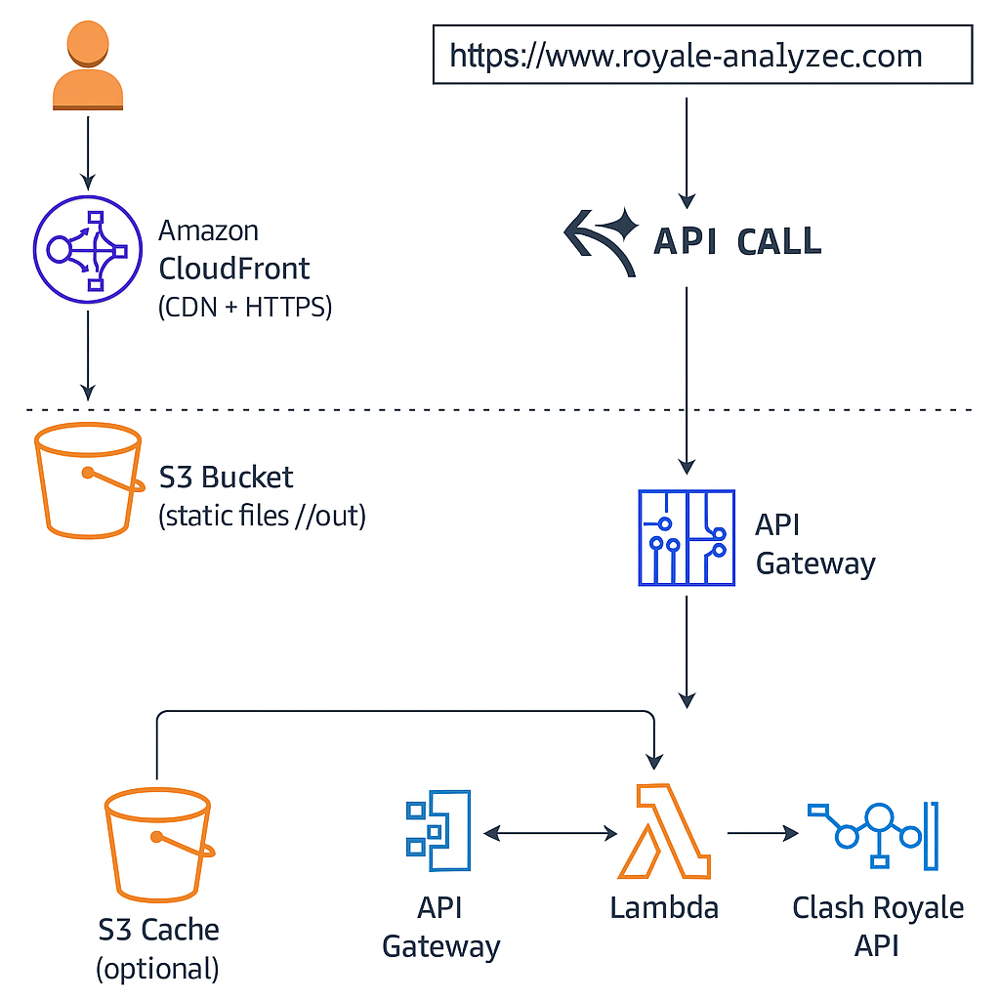

# 👑 Royale Analyzer

Royale Analyzer es una aplicación web que permite consultar información detallada sobre jugadores de **Clash Royale**, incluyendo nombre, trofeos, nivel, clan, cartas y más. El frontend es estático, moderno y rápido, y se conecta a un backend serverless en AWS que consume la API oficial de Clash Royale.

---

## 🚀 Demo

🔗 [https://www.royale-analyzer.com](https://www.royale-analyzer.com)

---

## 🧰 Tecnologías utilizadas

### Frontend

- [Next.js (Static Export)](https://nextjs.org/docs/pages/building-your-application/deploying/static-exports)
- [TypeScript](https://www.typescriptlang.org/)
- [Tailwind CSS](https://tailwindcss.com/)
- [Framer Motion](https://www.framer.com/motion/)
- [Lucide Icons](https://lucide.dev/)

### Backend

- **AWS Lambda** (función para consultar y cachear datos)
- **Amazon API Gateway** (exposición pública del endpoint `/player/{tag}`)
- **Clash Royale API** (fuente oficial de datos)

### Infraestructura en AWS

- Amazon S3 (hosting del frontend estático)
- Amazon CloudFront (CDN global)
- Amazon Route 53 (dominio personalizado)
- Amazon Certificate Manager (SSL para HTTPS)
- **VPC + Subred Privada + NAT Gateway** (acceso seguro a internet desde Lambda)
- IAM Roles & Policies (mínimos necesarios)
- GitHub Actions (CI/CD)

## Arquitectura del Proyecto

Este proyecto utiliza una arquitectura serverless basada en servicios de AWS.

### Instalación local
Clona el repositorio:

git clone https://github.com/JetCoco/Royale-Analyzer.git
cd Royale-Analyzer

### Instala dependencias:

npm install

### Exporta el sitio como estático:

npm run build && npm run export

### Previsualiza localmente:

npx serve out

### Despliegue (automático)
Cada vez que haces push a la rama main:

GitHub Actions ejecuta npm run build && npm run export

Sincroniza la carpeta /out al bucket S3

Aplica --cache-control "no-cache" para evitar problemas de versiones antiguas

Invalida el caché de CloudFront (/*) para reflejar cambios inmediatos

🔐 Seguridad
CORS configurado para aceptar únicamente desde https://www.royale-analyzer.com

Lambda corre en una VPC privada con salida solo mediante NAT Gateway

IAM Roles con permisos mínimos

SSL gestionado con AWS Certificate Manager

✅ Pendiente / Futuro
🎯 Favoritos por usuario

📊 Dashboard de estadísticas agregadas

🔒 Login con Amazon Cognito

💬 Compartir perfiles

🔎 Indexado por buscadores